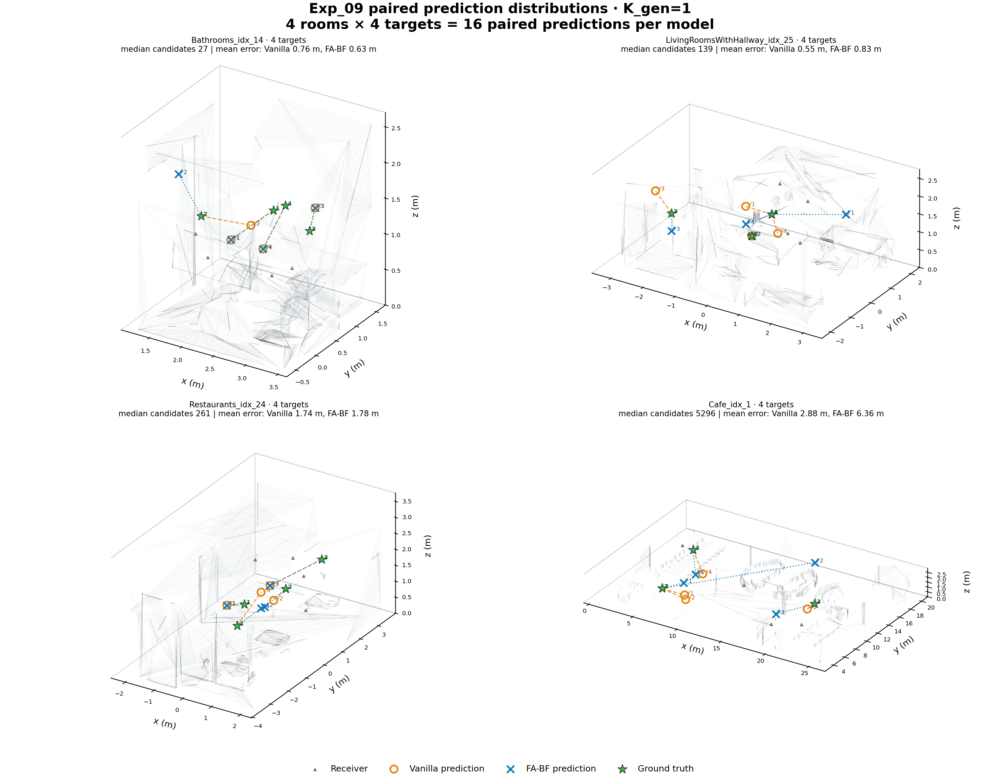
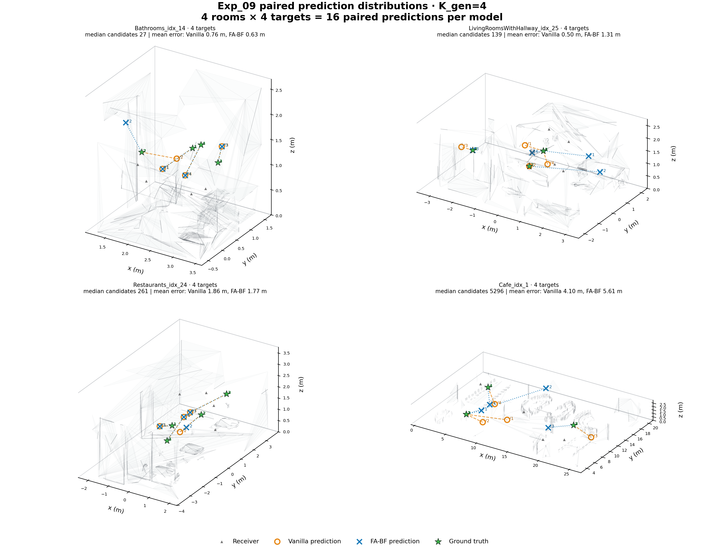
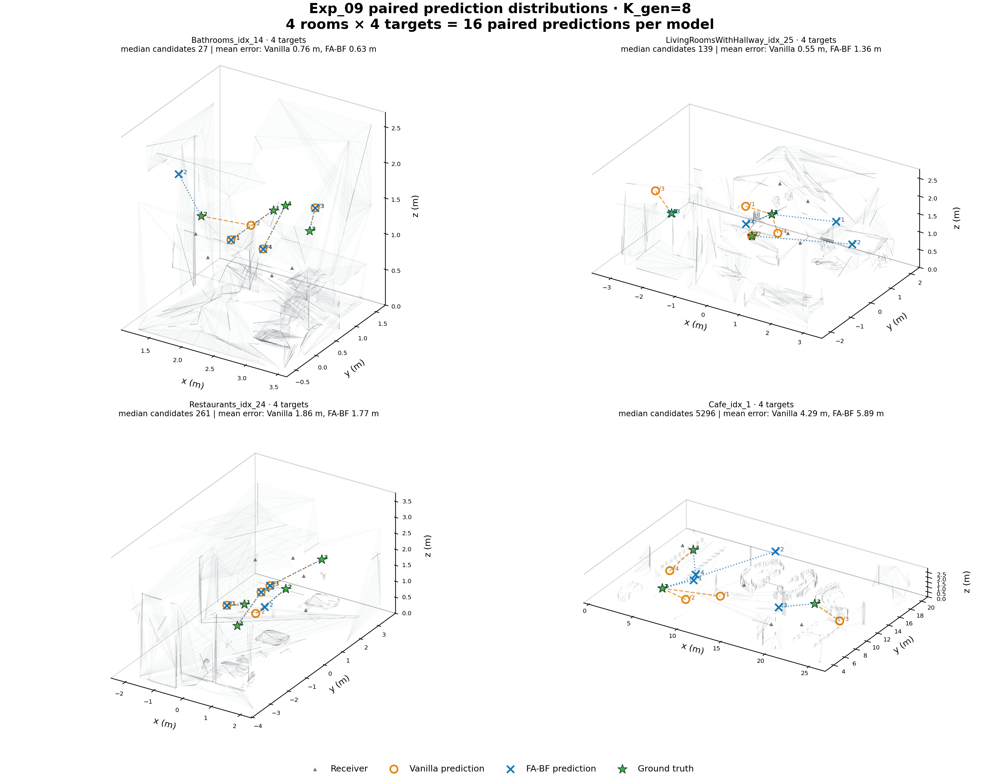

# Exp_09 paired prediction distributions

Each figure uses the same four rooms and the same four frozen batch-1 targets per room: 16 FA-BF predictions plus their 16 matched Vanilla predictions. Rooms are selected without using prediction error, at evenly spaced ranks after sorting the 16 rooms by median candidate count.

Ground truth is a green star, Vanilla an orange open circle, FA-BF a blue cross, and the receiver a gray triangle. Labels `1`-`4`, `V1`-`V4`, and `F1`-`F4` identify matched targets and predictions within each room.

## K_gen = 1

| Room | Candidate-count rank | Mean Vanilla error | Mean FA-BF error |
|---|---:|---:|---:|
| Bathrooms_idx_14 | 0 / 15 | 0.757 m | 0.628 m |
| LivingRoomsWithHallway_idx_25 | 5 / 15 | 0.553 m | 0.830 m |
| Restaurants_idx_24 | 10 / 15 | 1.740 m | 1.782 m |
| Cafe_idx_1 | 15 / 15 | 2.875 m | 6.361 m |

## K_gen = 4

| Room | Candidate-count rank | Mean Vanilla error | Mean FA-BF error |
|---|---:|---:|---:|
| Bathrooms_idx_14 | 0 / 15 | 0.757 m | 0.628 m |
| LivingRoomsWithHallway_idx_25 | 5 / 15 | 0.501 m | 1.313 m |
| Restaurants_idx_24 | 10 / 15 | 1.862 m | 1.774 m |
| Cafe_idx_1 | 15 / 15 | 4.096 m | 5.611 m |

## K_gen = 8

| Room | Candidate-count rank | Mean Vanilla error | Mean FA-BF error |
|---|---:|---:|---:|
| Bathrooms_idx_14 | 0 / 15 | 0.757 m | 0.628 m |
| LivingRoomsWithHallway_idx_25 | 5 / 15 | 0.553 m | 1.362 m |
| Restaurants_idx_24 | 10 / 15 | 1.862 m | 1.774 m |
| Cafe_idx_1 | 15 / 15 | 4.289 m | 5.886 m |

The translucent room geometry is a display-only decimation of the hash-checked official OBJ. Marker coordinates and errors are unchanged, hash-validated model outputs in the global AcousticRooms coordinate system.
