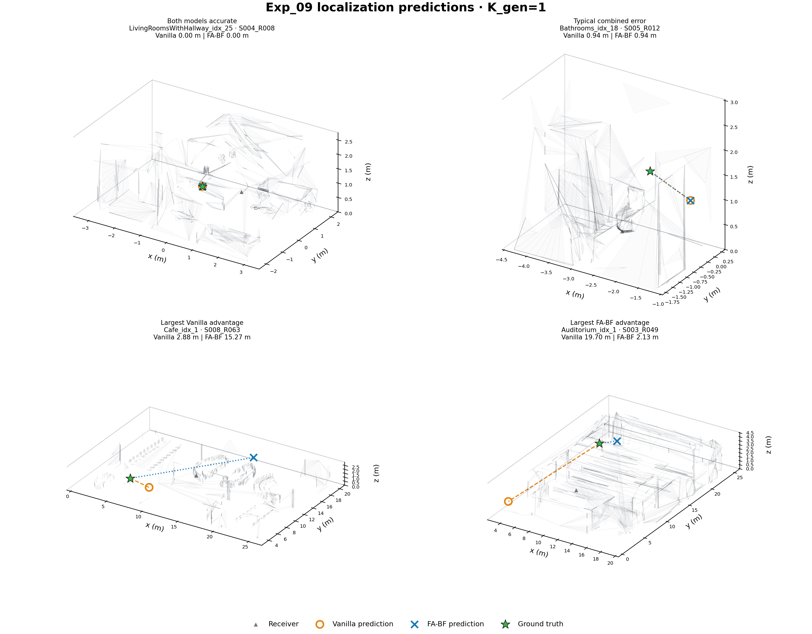
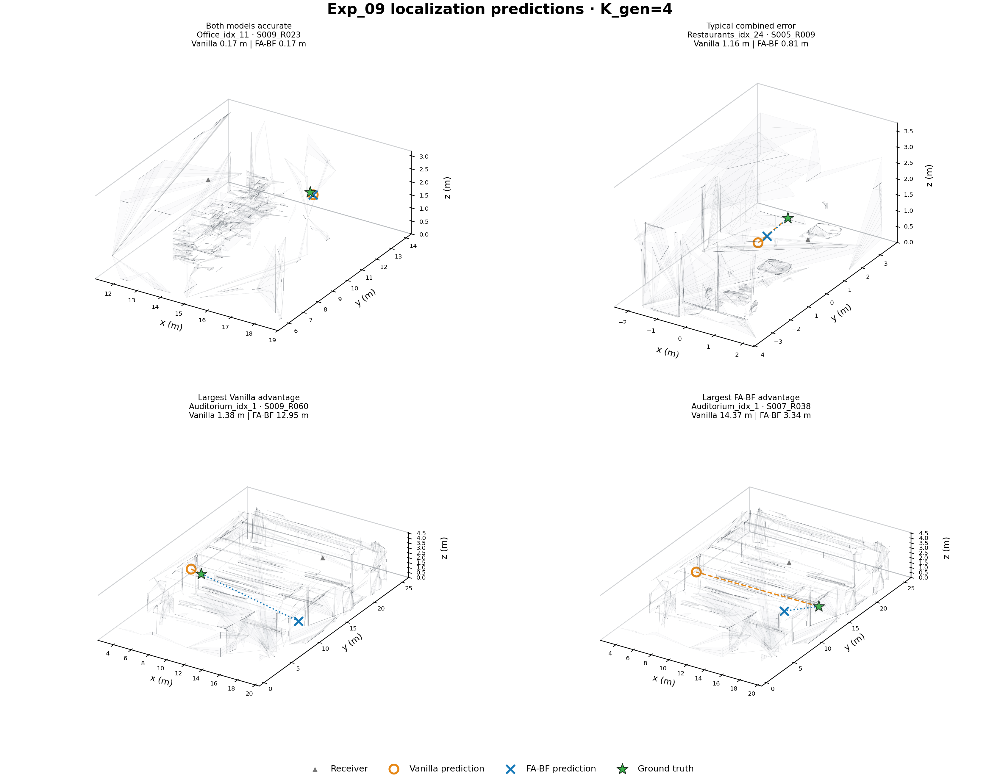
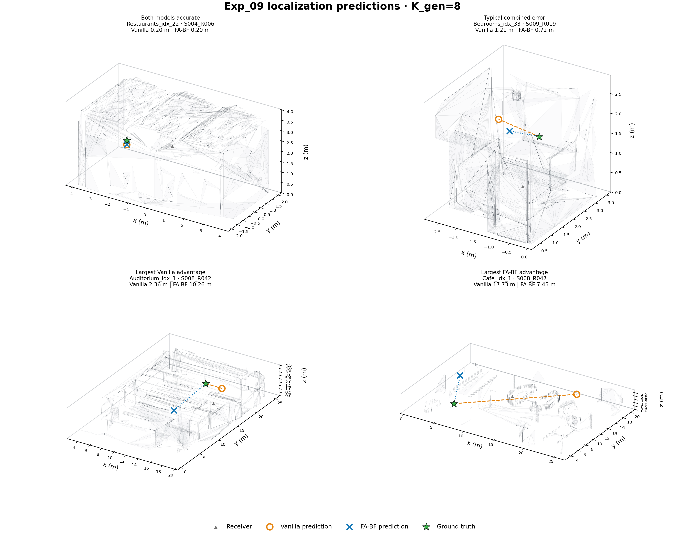

# Exp_09 localization prediction examples

The 12 targets below were selected deterministically from the two completed, non-overlapping 64-query pilot batches. Selection uses no manual cherry-picking: for each `K_gen`, it shows a jointly accurate case, a typical combined-error case, the largest remaining Vanilla advantage, and the largest remaining FA-BF advantage. Targets are not reused across panels.

Markers: ground truth = green star; Vanilla = orange open circle; FA-BF = blue cross; receiver = gray triangle. Dashed/dotted segments show localization error.

## K_gen = 1

| Case | Batch | Room / target | Vanilla error | FA-BF error |
|---|---|---|---:|---:|
| Both models accurate | batch1 | LivingRoomsWithHallway_idx_25 / S004_R008 | 0.000 m | 0.000 m |
| Typical combined error | batch1 | Bathrooms_idx_18 / S005_R012 | 0.935 m | 0.935 m |
| Largest Vanilla advantage | batch1 | Cafe_idx_1 / S008_R063 | 2.880 m | 15.273 m |
| Largest FA-BF advantage | batch1 | Auditorium_idx_1 / S003_R049 | 19.695 m | 2.130 m |

## K_gen = 4

| Case | Batch | Room / target | Vanilla error | FA-BF error |
|---|---|---|---:|---:|
| Both models accurate | batch1 | Office_idx_11 / S009_R023 | 0.166 m | 0.166 m |
| Typical combined error | batch1 | Restaurants_idx_24 / S005_R009 | 1.164 m | 0.809 m |
| Largest Vanilla advantage | batch1 | Auditorium_idx_1 / S009_R060 | 1.378 m | 12.950 m |
| Largest FA-BF advantage | batch1 | Auditorium_idx_1 / S007_R038 | 14.372 m | 3.337 m |

## K_gen = 8

| Case | Batch | Room / target | Vanilla error | FA-BF error |
|---|---|---|---:|---:|
| Both models accurate | batch1 | Restaurants_idx_22 / S004_R006 | 0.200 m | 0.200 m |
| Typical combined error | batch2 | Bedrooms_idx_33 / S009_R019 | 1.213 m | 0.721 m |
| Largest Vanilla advantage | batch2 | Auditorium_idx_1 / S008_R042 | 2.364 m | 10.258 m |
| Largest FA-BF advantage | batch2 | Cafe_idx_1 / S008_R047 | 17.728 m | 7.446 m |

The translucent geometry is a display-only decimation of the audited official OBJ. All markers use the untouched AcousticRooms global coordinates, and errors come directly from the hash-validated result JSON files.
